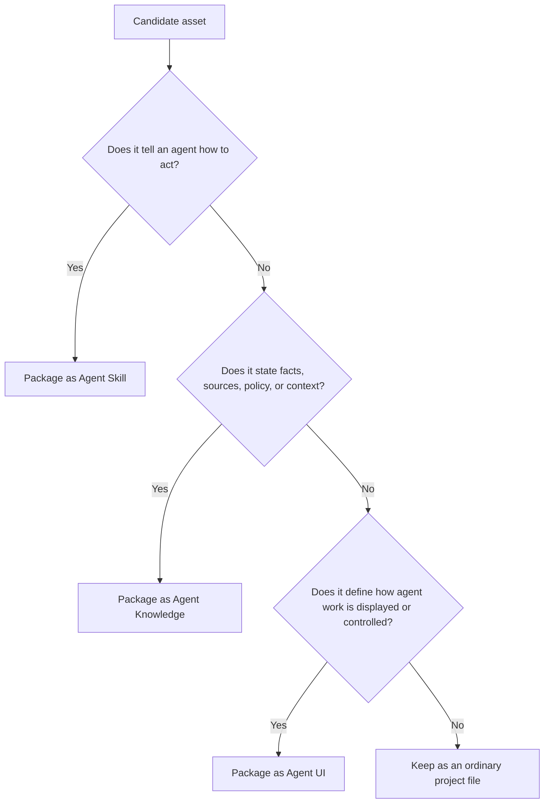

# Agent UI vs Agent Skills and Agent Knowledge

Agent UI is not a Skill package and not a Knowledge pack. It is a third standard for user-facing agent interaction semantics.

- **Agent Skills** describe how an agent performs work: workflows, scripts, tool usage, and templates.
- **Agent Knowledge** describes source-grounded assets: facts, documents, policies, status, and audit trails.
- **Agent UI** describes how agent work is presented and controlled: surfaces, states, actions, accessibility, and acceptance checks.

This boundary matters because execution, facts, and presentation fail in different ways.

## Decision rule



Simplified rule:

- If it says **run this workflow or use this tool**, put it in Agent Skills.
- If it says **this is true, sourced, reviewed, stale, or disputed**, put it in Agent Knowledge.
- If it says **show this state, offer this control, separate this surface, or test this interaction**, put it in Agent UI.

## Boundary table

| Boundary | Agent Skills | Agent Knowledge | Agent UI |
| --- | --- | --- | --- |
| Primary role | Executable capability | Source-grounded knowledge | Interaction projection |
| Entry file | `SKILL.md` | `KNOWLEDGE.md` | `AGENTUI.md` |
| Core content | Instructions, scripts, workflows, tool use. | Facts, sources, maintained documents, compiled context. | Surface patterns, state models, controls, acceptance checks. |
| Runtime verb | Execute, transform, verify, maintain, apply. | Ground, cite, constrain, verify, resolve. | Render, disclose, collapse, approve, interrupt, hand off. |
| Trust model | May drive tools after trust and activation checks. | Must be fenced as data. | Must be treated as projection guidance. |
| Failure mode | Unsafe or wrong action. | Fabricated, stale, or injected facts. | Misleading state, hidden control, polluted final answer. |

## How they compose

A client may use all three for one agent task:

```text
user request
  -> select Skill for procedure
  -> select Knowledge for facts and boundaries
  -> select Agent UI for interaction surfaces
  -> run agent with visible process, tasks, artifacts, and evidence
```

Rules:

1. Skills may create artifacts that UI surfaces display.
2. Knowledge may provide citations that Evidence surfaces render.
3. Agent UI may define where approval and artifact editing appear.
4. Agent UI must not execute the Skill or reinterpret the Knowledge as instructions.
5. Agent UI must not invent success, citation, or artifact state when runtime facts are missing.

## Common confusions

| Asset | Correct location | Reason |
| --- | --- | --- |
| A workflow for reviewing pull requests. | Agent Skills | It tells the agent how to act. |
| A repository's approved release policy. | Agent Knowledge | It is source-grounded context. |
| A pattern for showing review findings, patch links, and verification status. | Agent UI | It defines presentation and control. |
| A script that exports evidence. | Agent Skills or client tool | It performs work. |
| The exported evidence pack. | Agent Knowledge or runtime evidence store | It is data and audit record. |
| The UI card for opening the evidence pack. | Agent UI | It is a surface pattern. |

## Non-goals

Agent UI does not standardize a full agent runtime, model event protocol, CSS system, component library, memory layer, or artifact storage format. It standardizes a file-first way to describe UI projection semantics that compatible clients can adopt or adapt.
