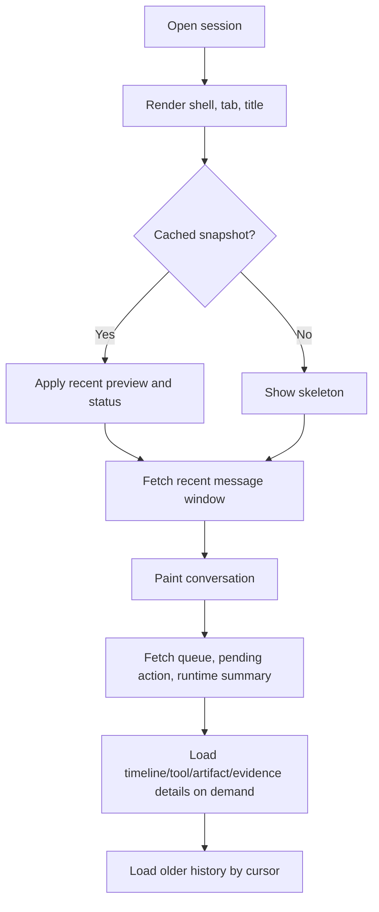

# Runtime standard

This guide describes how an agent client should implement Agent UI. The core integration is the same across desktop apps, IDEs, terminals, web apps, and embedded assistants: consume structured runtime facts, project them into UI state, and route user controls back through controlled APIs.

## Core principle: projection, not ownership

```text
runtime facts
  + artifact facts
  + evidence facts
  + optional application state
  -> UI projection
  -> user-visible surfaces and controlled actions
```

A compatible client MUST NOT let UI projection become the source of runtime identity, tool output, artifact contents, permission state, verification results, or approval state.

## Step 1: Identify fact sources

Start from real product/runtime facts, not from a standalone manifest file.

| Source | Required examples | Notes |
| --- | --- | --- |
| Event stream | lifecycle, text, reasoning, tool, action, queue, artifact, evidence events | Register listeners before submitting work. |
| Session snapshot | recent messages, thread/run status, queue, pending requests, history cursor | Used for old-session recovery and stream repair. |
| Artifact service | artifact id, kind, preview, path/ref, version, diff, save/export status | Full content loads on demand. |
| Evidence service | trace, source/citation, verification, review, replay, handoff | Evidence should be durable and auditable. |
| Application state | selected workspace, active tab, file attachments, model/mode selections | Keep separate from runtime facts. |

## Step 2: Normalize event classes

Create an adapter layer that maps your source protocol into generic Agent UI event classes.

Common mappings:

| Source idea | Agent UI class |
| --- | --- |
| Lifecycle start/finish/error events | `run.started`, `run.finished`, `run.failed` |
| Text message events or AI SDK text parts | `text.delta`, `text.final` |
| Reasoning/thinking events or AI SDK reasoning parts | `reasoning.delta`, `reasoning.summary` |
| Tool lifecycle events and structured tool results | `tool.started`, `tool.args`, `tool.progress`, `tool.result` |
| Interrupt outcomes, widget/tool requests, or custom approval events | `action.required`, `action.resolved` |
| Runtime queue snapshot or busy-session submission mode | `queue.changed` |
| Artifact write/snapshot/diff events | `artifact.changed` |
| Evidence, review, replay, trace, or source-map events | `evidence.changed` |
| Durable thread state, external app state, or message repair | `state.snapshot`, `state.delta`, `messages.snapshot` |

The adapter is a compatibility boundary. Do not spread source-specific event parsing across UI components.

## Step 3: Maintain a projection store

Recommended store responsibilities:

- Keep a recent message window and hydration cursor.
- Store run status, pending actions, queue summaries, and tool summaries by stable id.
- Reference artifacts and evidence by id/ref instead of copying full payloads.
- Track UI-only state such as selected tab, collapsed rows, focused artifact, and draft.
- Preserve raw diagnostics only in safe debug channels.

Projection state can be recreated from snapshots and events. If it cannot be recreated, it probably owns facts it should not own.

## Step 4: Render surfaces from projection

Render by surface responsibility:

| Surface | Rendering rule |
| --- | --- |
| Composer | Show draft, context chips, attachments, model/mode, permission hints, and queue/steer mode. |
| Message Parts | Render final answer text separately from reasoning, tools, actions, artifacts, and evidence. |
| Runtime Status | Show accepted/routing/preparing before first text, then streaming/tool/blocked/retrying/failed/completed. |
| Tool UI | Compress input/output, redact secrets, offload large payloads, and link detail views. |
| Human-in-the-loop | Show explicit approve/reject/edit/input controls with stable request ids. |
| Task Capsule | Summarize running, queued, needs-input, plan-ready, failed, cancelled, and subagent states. |
| Artifact / Canvas | Open deliverables in a dedicated surface with preview, edit, diff, save, and export paths. |
| Timeline / Evidence | Show process history, citations, verification, review, replay, and handoff on demand. |
| Session / Tabs | Keep inactive sessions lightweight with snapshots and lazy hydration. |

## Step 5: Wire controlled writes

User controls write through owning services.

| Control | API boundary |
| --- | --- |
| Send | Runtime submit API |
| Queue | Runtime queue API |
| Steer | Runtime steer/resume API |
| Interrupt/cancel | Runtime interrupt API |
| Approve/reject/respond | Runtime action response API |
| Edit/save/export artifact | Artifact service |
| Export/review/replay evidence | Evidence/review/replay service |
| Load older history | Session history API |

Every write should return a fact or updated snapshot. UI state should not declare success by itself.

## Step 6: Hydrate progressively

Old session open flow:



Do not block shell rendering on full timeline, all tool outputs, all artifacts, or evidence export payloads.

## Step 7: Instrument performance

At minimum, measure:

- send click -> listener bound
- listener bound -> submit accepted
- submit accepted -> first event
- first event -> first runtime status
- first status -> first text delta
- first text delta -> first text paint
- delta backlog depth and oldest unrendered age
- old-session click -> shell paint
- old-session click -> recent messages paint
- detail success -> timeline idle complete
- active mounted message lists, timeline rows, and hydrated tabs

These metrics are part of the UI contract because they determine whether the interface is actually usable for long-running agents.
