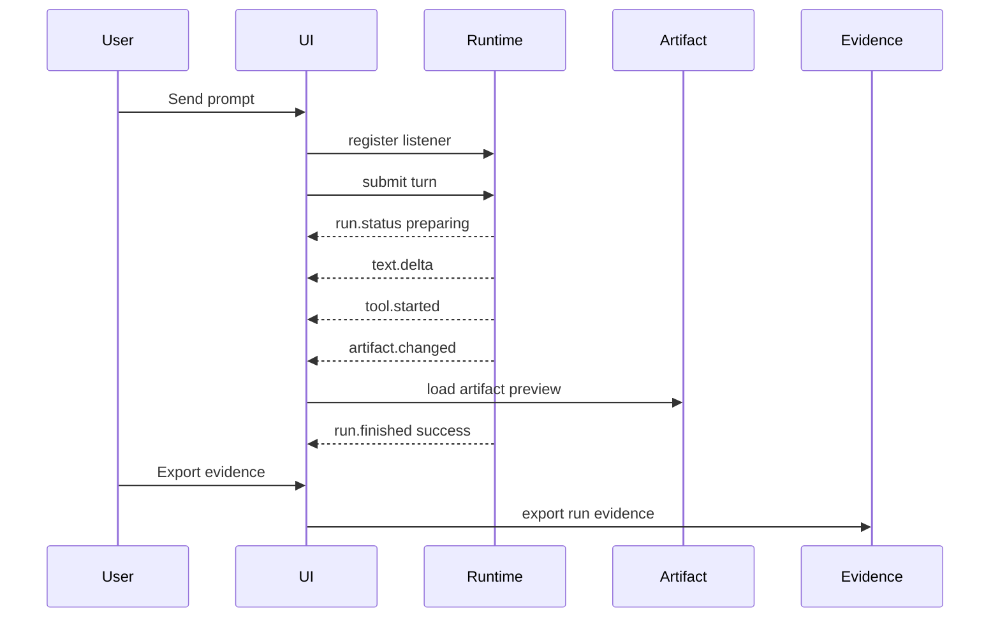

# Basic agent workbench

This example shows a minimal agent workbench that consumes runtime events and durable snapshots. It is not a reusable file bundle. The implementation can live inside an existing product codebase.

## Layout

```text
BasicAgentWorkbench
  SessionTabs
  TaskCapsuleStrip
  ConversationPane
    MessageList
    RuntimeStatusStrip
    Composer
  WorkbenchPane
    ArtifactCanvas
    EvidencePanel
  ProcessDrawer
    ToolTimeline
    Diagnostics
```

## Event adapter

```ts
function normalizeRuntimeEvent(event: RuntimeEvent): AgentUiEvent[] {
  switch (event.kind) {
    case 'turn_started':
      return [{ type: 'run.started', sessionId: event.sessionId, runId: event.turnId }]
    case 'runtime_status':
      return [{ type: 'run.status', runId: event.turnId, stage: event.stage, detail: event.detail }]
    case 'text_delta':
      return [{ type: 'text.delta', runId: event.turnId, messageId: event.messageId, delta: event.text }]
    case 'thinking_delta':
      return [{ type: 'reasoning.delta', runId: event.turnId, partId: event.partId, delta: event.text }]
    case 'tool_start':
      return [{ type: 'tool.started', runId: event.turnId, toolCallId: event.toolCallId, name: event.name, inputSummary: event.inputSummary }]
    case 'artifact_snapshot':
      return [{ type: 'artifact.changed', runId: event.turnId, artifactId: event.artifactId, kind: event.kind, preview: event.preview }]
    default:
      return []
  }
}
```

## Surface behavior

| Surface | Behavior |
| --- | --- |
| Session Tabs | Inactive sessions show title, last activity, running/queued/pending count, and stale marker. |
| Task Capsule | Running is quiet; `needs-input`, `plan-ready`, and `failed` get attention. |
| Message Parts | User text and assistant final text stay readable; reasoning and tools are separate parts. |
| Runtime Status | `submitted`, `routing`, and `preparing` appear before first text. |
| Tool Timeline | Tool rows show safe input summary, progress, result, and detail link. |
| Artifact Canvas | Latest important artifact opens in a workbench surface. |
| Evidence Panel | Evidence export is a background action with durable links. |

## Send flow



## Acceptance

The workbench is acceptable when:

1. First runtime status appears before first text.
2. Tool calls are visible but not injected into final answer text.
3. Reasoning is collapsed or summarized by default.
4. Generated artifacts open outside the message body.
5. Queue and steer are visually different.
6. Pending approval has an explicit controlled response path.
7. Old sessions render recent messages before timeline details.
8. Evidence export is linked to the same run/session facts.
