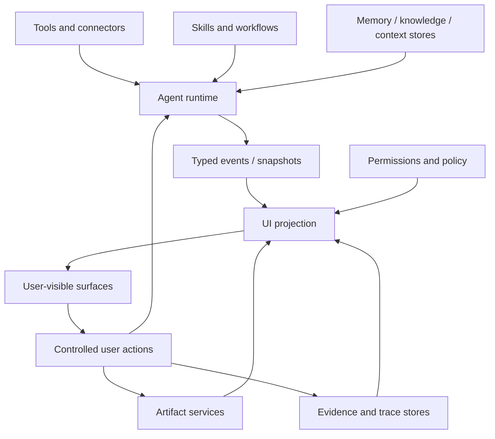

# Agent UI ecosystem boundaries

Agent UI should not be framed as only a companion to one or two adjacent standards. It serves the full agent product loop: runtime, model output, tool execution, skills and workflows, human approval, artifacts, evidence, sessions, permissions, context, and the host product interface.

This page answers one question: what belongs to Agent UI, and what is an external fact that Agent UI projects, references, or controls.

## Core test

Rules:

- If it defines **how users see, control, resume, edit, or audit agent work**, it belongs to Agent UI.
- If it defines **how an agent performs a workflow, calls a tool, or maintains work**, it belongs to a workflow or skill system.
- If it defines **facts, sources, policy, memory, citations, or context boundaries**, it belongs to a memory, knowledge, or policy system.
- If it defines **files, canvases, diffs, exports, or durable editable results**, it belongs to an artifact system.
- If it defines **trace, review, replay, verification, or evidence packs**, it belongs to an evidence or observability system.
- If it defines **model protocols, tool protocols, storage formats, or component styling**, it is not the core Agent UI standard; Agent UI only defines how those facts become interaction semantics.

## Boundary table

| Adjacent system | It owns | Agent UI owns | Common mistake |
| --- | --- | --- | --- |
| Agent runtime | Authoritative run, turn, task, event, and snapshot state. | Projection of runtime facts into status, messages, tasks, and controls. | UI guesses whether a run succeeded. |
| Model / provider | Model input/output, stream deltas, finish reasons, usage. | Typed rendering of text, reasoning, tool requests, and errors. | Raw provider logs leak into the final answer. |
| Tools / connectors | Tool execution, inputs, outputs, safety boundary, result data. | Tool progress, compressed summaries, detail entrypoints, recovery UI. | UI treats tool output as executable instruction. |
| Skills / workflows | Executable procedures, scripts, templates, maintenance methods. | What the procedure is doing, waiting for, and allowing the user to do. | UI documentation becomes an execution manual. |
| Memory / knowledge / context stores | Facts, sources, citations, policy, context, freshness. | Citation rendering, missing states, trust hints, source entrypoints. | UI invents citations or reinterprets context as instructions. |
| Artifact services | Files, objects, canvases, diffs, versions, exports. | Artifact cards, previews, editing entrypoints, handoff state. | Large file content is dumped into chat text. |
| Evidence / observability | Trace, review, replay, verification, audit records. | Timeline, evidence surface, export progress, audit entrypoints. | Evidence status becomes untraceable UI copy. |
| Permission / policy | Permissions, risk level, approval result, execution scope. | Human-in-the-loop requests and approve/reject/edit controls. | UI marks approval before runtime confirmation. |
| Session / storage | Session identity, history, snapshots, indexes. | Progressive hydration, tab state, recovery hints, loading windows. | Old sessions require full history and all artifacts before first paint. |
| Design system | Visual components, tokens, layout rules, responsive behavior. | Surface semantics and behavior-level acceptance. | Agent UI is reduced to a component library or skin. |

## What Agent UI actually standardizes

Agent UI standardizes the **projection layer from runtime facts to user interaction semantics**:

1. Which event classes compatible clients should recognize.
2. Which surfaces answer which user questions.
3. Which user actions must write through controlled APIs.
4. How missing, failed, blocked, waiting, and old-session states are shown honestly.
5. How reasoning, tool output, traces, artifacts, and final answers stay separated instead of collapsing into one text column.

## Non-goals

Agent UI does not own a full agent runtime, model protocol, tool registry, memory system, knowledge base, artifact store, evidence store, permission engine, CSS system, or component implementation. It only defines how compatible clients project facts from those systems into clear, controllable, resumable, and auditable interaction surfaces.
