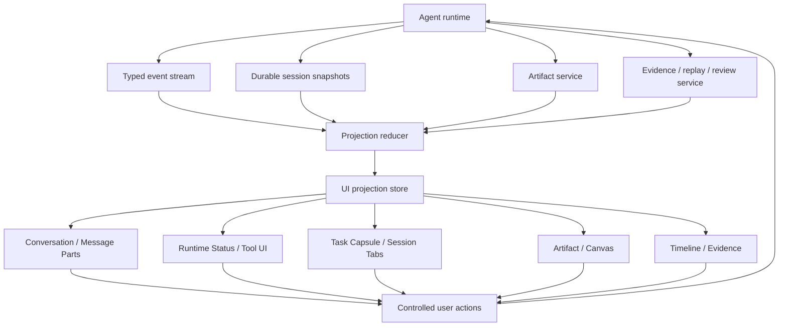

# Specification

Agent UI v0.2 is a runtime-first standard for agent interaction surfaces. The core contract is the runtime projection boundary between agent facts and user-visible UI.

- **Agent Skills** define executable capabilities and procedures.
- **Agent Knowledge** defines source-grounded context and facts.
- **Agent UI** defines how runtime facts become visible, controllable, resumable, editable, and auditable.

## Scope

Agent UI standardizes these implementation concerns:

1. Event classes and durable snapshots a client can project.
2. Surface responsibilities and fallback states.
3. User actions that write through controlled APIs.
4. Hydration, progressive rendering, queue/steer, and performance budgets.
5. Acceptance scenarios for real agent workbenches.

Agent UI does **not** standardize a model protocol, tool registry, artifact store, CSS system, component library, or visual skin.

## Projection architecture

The projection store may hold UI-only state such as selected tab, collapsed sections, visible window, focused artifact, or local draft. It must not become authoritative for runtime identity, tool output, artifact content, permission state, or evidence verdicts.

## Required fact owners

A compatible implementation SHOULD keep these owners separate:

| Owner | Examples | Writer | UI usage |
| --- | --- | --- | --- |
| Runtime facts | session id, turn id, lifecycle status, text deltas, tool calls, queue state, action requests | Agent runtime or protocol adapter | Conversation, Process, Task |
| Artifact facts | artifact id, kind, path, version, preview, diff, metadata | Artifact service | Artifact / Canvas |
| Evidence facts | trace, citation, verification, replay id, review decision, audit record | Evidence or review service | Timeline / Evidence |
| UI projection | visible message window, collapsed tool count, selected tab, local draft, display label | UI controller | Rendering only |

Projection state may reference facts by id. It should not copy large payloads or derive success from prose.

## Standard event classes

Agent UI uses generic event class names so clients can adapt AI SDK UI, OpenAI Apps SDK, custom desktop runtimes, event-stream runtimes, or other sources into the same projection model.

| Event class | Purpose | Primary surface |
| --- | --- | --- |
| `run.started` | Establish run, turn, or task boundary. | Runtime Status, Task |
| `run.status` | Show submitted, routing, preparing, streaming, retrying, cancelled, failed, or completed state. | Runtime Status |
| `text.delta` / `text.final` | Stream and reconcile final answer text. | Message Parts |
| `reasoning.delta` / `reasoning.summary` | Show thinking or reasoning outside final answer text. | Process |
| `tool.started` / `tool.args` / `tool.progress` / `tool.result` | Render tool lifecycle, inputs, outputs, and large-output references. | Tool UI, Timeline |
| `action.required` / `action.resolved` | Pause for approval, structured input, plan decision, or correction. | Human-in-the-loop, Task |
| `queue.changed` | Display queued turns, steer intent, queue order, and queue mutations. | Task Capsule, Composer |
| `artifact.changed` | Link generated or edited deliverables to artifact surfaces. | Artifact / Canvas |
| `evidence.changed` | Link citations, traces, verification, replay, and review. | Timeline / Evidence |
| `state.snapshot` / `state.delta` | Synchronize external application or agent state. | Session Tabs, Task, custom surfaces |
| `messages.snapshot` | Hydrate or repair conversation history. | Message Parts, Session Tabs |
| `run.finished` / `run.failed` | Reconcile completion, interrupt, cancellation, or failure. | Runtime Status, Task, Evidence |

## Standard surfaces

| Surface | User question | Must not own |
| --- | --- | --- |
| Composer | What am I about to send, with which context, mode, attachments, and queue/steer intent? | Runtime queue facts or permission grants. |
| Message Parts | What did the user and assistant say, and which parts are final answer vs process? | Tool output, reasoning, or artifacts as plain final text. |
| Runtime Status | Is the agent accepted, routing, waiting, streaming, blocked, retrying, cancelled, failed, or done? | Provider truth beyond runtime facts. |
| Tool UI | Which tool is running, with what safe input summary, output preview, and detail link? | Tool execution or raw secret-bearing payloads. |
| Human-in-the-loop | What does the user need to approve, reject, edit, or answer? | Permission state without runtime confirmation. |
| Task Capsule | What is running, queued, blocked, failed, or needs attention across turns and subagents? | Complete session history. |
| Artifact / Canvas | Where is the deliverable, how can it be previewed, edited, diffed, saved, or exported? | Artifact content without artifact service ownership. |
| Timeline / Evidence | What happened, what supports the result, and how can it be replayed or reviewed? | Verification verdicts not produced by evidence systems. |
| Session / Tabs | Which sessions or threads are active, hydrated, stale, unread, running, or pinned? | Full detail for inactive sessions. |

## Controlled write actions

UI actions that change state MUST write through the owning system:

| UI action | Required fact | Write boundary |
| --- | --- | --- |
| Send prompt | session/thread id, draft, context refs, mode | Runtime submit API |
| Queue input | active run or busy session, draft, queue policy | Runtime queue API |
| Steer current run | active run id, steering payload, policy | Runtime steer or resume API |
| Interrupt | run id, turn id, task id, or session id | Runtime interrupt API |
| Approve/reject | action request id, decision, optional payload | Runtime action response API |
| Edit artifact | artifact id, version, patch/content | Artifact service |
| Export evidence | session/run/task id | Evidence export API |
| Open older history | session id, cursor/window | Session history API |

If a write fails, the UI should keep existing facts, mark the attempted action as failed, and provide a recoverable path.

## Hydration and progressive rendering

Old sessions and long runs must not block on full detail. A compatible implementation SHOULD load in this order:

1. Shell, title, tab, lightweight runtime snapshot.
2. Recent message window.
3. Current run status, pending action, and queue summary.
4. Timeline summary and compact tool/artifact references.
5. Full tool output, artifact content, evidence payload, and older history only on demand.

`historyLimit`, cursor-based pagination, idle timeline construction, and large output offload are part of the UI contract because they directly change whether an agent workspace remains usable.

## Fallback states

When facts are absent or delayed, show honest state:

- `loading`: request started, fact not available yet.
- `unknown`: client cannot know the state from available facts.
- `unavailable`: producer does not provide this fact.
- `stale`: snapshot may be outdated.
- `blocked`: runtime cannot proceed without another fact or action.
- `needs-input`: user action is required.
- `failed`: owning system reported failure.
- `disputed`: evidence/review state conflicts.

A compatible UI MUST NOT infer artifact kind, permission grant, success, verification pass, or user approval from ordinary message text.

## Validation

A validator SHOULD check behavior and contracts, not only files:

- Event adapter maps lifecycle, text, reasoning, tool, action, queue, artifact, evidence, and session events into typed projection state.
- Final text reconciliation prevents duplicate streamed/final output.
- Reasoning, tool output, runtime status, artifacts, and evidence do not pollute final answer text.
- Missing facts render honest fallback states.
- User actions write through controlled runtime/artifact/evidence APIs.
- Old sessions hydrate progressively with bounded history and on-demand details.
- Acceptance scenarios cover send, first status, tool call, action request, queue/steer, artifact handoff, evidence export, failure, and old-session recovery.
