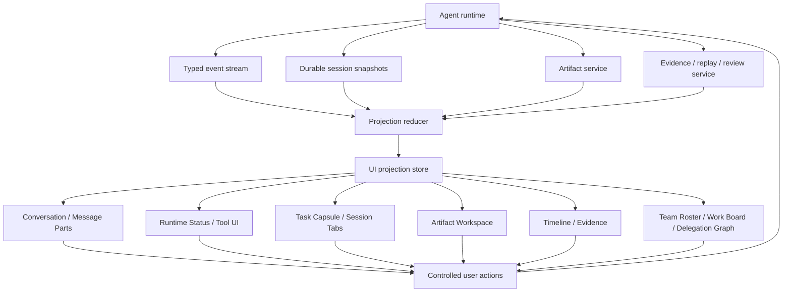

# Specification

Agent UI v0.6 is a runtime-first standard for agent interaction surfaces. The core contract is the projection boundary between agent facts and user-visible UI.

Agent UI defines how runtime, tool, workflow, context, permission, artifact, evidence, session, task, and team facts become visible, controllable, resumable, editable, and auditable without turning the UI into the authority for those facts.

See [Flow and taxonomy](../../reference/flow-and-taxonomy) for the complete lifecycle, event envelope, owner/scope/phase/surface taxonomy, and validation checklist. See [Source index](../../reference/source-index) for traceable citations.

## Scope

Agent UI standardizes these implementation concerns:

1. Event classes and durable snapshots a client can project.
2. Surface responsibilities and fallback states.
3. User actions that write through controlled APIs.
4. Hydration, progressive rendering, queue/steer, and performance budgets.
5. Team workbench surfaces for coordinator/teammate work, parallel workers, handoffs, review, background teammates, and remote teammates.
6. Acceptance scenarios for real agent workbenches.

Agent UI does **not** standardize a model protocol, tool registry, artifact store, CSS system, component library, or visual skin.

## Projection architecture

The projection store may hold UI-only state such as selected tab, collapsed sections, visible window, focused artifact, or local draft. It must not become authoritative for runtime identity, tool output, artifact content, permission state, or evidence verdicts.

## Required fact owners

A compatible implementation SHOULD keep these owners separate:

| Owner | Examples | Writer | UI usage |
| --- | --- | --- | --- |
| Runtime facts | session id, turn id, lifecycle status, text deltas, tool calls, queue state, action requests | Agent runtime or protocol adapter | Conversation, Process, Task |
| Artifact facts | artifact id, kind, read ref, version, preview, diff, metadata, export state | Artifact service | Artifact Workspace |
| Evidence facts | trace, citation, verification, replay id, review decision, audit record | Evidence or review service | Timeline / Evidence |
| Team facts | teammate id, role, parent/child session, work item, handoff, worker notification, remote task status | Agent runtime, team runtime, remote-agent adapter, work-board service | Team Roster, Work Board, Delegation Graph |
| UI projection | visible message window, collapsed tool count, selected tab, local draft, display label | UI controller | Rendering only |

Projection state may reference facts by id. It should not copy large payloads or derive success from prose.

## Standard event classes

Agent UI uses generic event class names so clients can adapt AI SDK UI, OpenAI Apps SDK, custom desktop runtimes, event-stream runtimes, or other sources into the same projection model.

| Event class | Purpose | Primary surface |
| --- | --- | --- |
| `run.started` | Establish run, turn, or task boundary. | Runtime Status, Task |
| `run.status` | Show submitted, routing, preparing, streaming, retrying, cancelled, failed, or completed state. | Runtime Status |
| `text.delta` / `text.final` | Stream and reconcile final answer text. | Message Parts |
| `reasoning.delta` / `reasoning.summary` | Show thinking or reasoning outside final answer text. | Process |
| `tool.started` / `tool.args` / `tool.progress` / `tool.result` | Render tool lifecycle, inputs, outputs, and large-output references. | Tool UI, Timeline |
| `action.required` / `action.resolved` | Pause for approval, structured input, plan decision, or correction. | Human-in-the-loop, Task |
| `queue.changed` | Display queued turns, steer intent, queue order, and queue mutations. | Task Capsule, Composer |
| `agent.spawned` / `agent.completed` / `agent.changed` | Display teammate, subagent, worker, or remote-agent lifecycle. | Team Roster, Task Capsule |
| `team.changed` | Display roster, work-board, selected team, team memory, or team policy changes. | Team Roster, Work Board |
| `agent.handoff` | Display active owner transfer with reason and resume target. | Handoff Lane, Delegation Graph |
| `worker.notification` | Display worker result/failure/kill summaries without treating them as user messages. | Worker Notifications, Timeline |
| `review.requested` / `review.completed` | Display reviewer/verifier work and verdicts. | Review Lane, Evidence |
| `artifact.created` / `artifact.updated` / `artifact.preview.ready` / `artifact.version.created` / `artifact.diff.ready` / `artifact.export.started` / `artifact.export.completed` / `artifact.failed` / `artifact.deleted` | Link generated, edited, previewed, versioned, diffed, exported, failed, or removed deliverables to Artifact Workspace. | Artifact Workspace |
| `evidence.changed` | Link citations, traces, verification, replay, and review. | Timeline / Evidence |
| `state.snapshot` / `state.delta` | Synchronize external application or agent state. | Session Tabs, Task, custom surfaces |
| `messages.snapshot` | Hydrate or repair conversation history. | Message Parts, Session Tabs |
| `run.finished` / `run.failed` | Reconcile completion, interrupt, cancellation, or failure. | Runtime Status, Task, Evidence |

## Standard surfaces

| Surface | User question | Must not own |
| --- | --- | --- |
| Composer | What am I about to send, with which context, mode, attachments, and queue/steer intent? | Runtime queue facts or permission grants. |
| Message Parts | What did the user and assistant say, and which parts are final answer vs process? | Tool output, reasoning, or artifacts as plain final text. |
| Runtime Status | Is the agent accepted, routing, waiting, streaming, blocked, retrying, cancelled, failed, or done? | Provider truth beyond runtime facts. |
| Tool UI | Which tool is running, with what safe input summary, output preview, and detail link? | Tool execution or raw secret-bearing payloads. |
| Human-in-the-loop | What does the user need to approve, reject, edit, or answer? | Permission state without runtime confirmation. |
| Task Capsule | What is running, queued, blocked, failed, or needs attention across turns and subagents? | Complete session history. |
| Artifact Workspace | Where is the deliverable, how can it be previewed, edited, diffed, versioned, exported, reused, or handed off? | Artifact content without artifact service ownership. |
| Timeline / Evidence | What happened, what supports the result, and how can it be replayed or reviewed? | Verification verdicts not produced by evidence systems. |
| Session / Tabs | Which sessions or threads are active, hydrated, stale, unread, running, or pinned? | Full detail for inactive sessions. |
| Team Roster | Who is on the team, what role/capability/policy does each teammate have, and who needs attention? | Runtime teammate identity or permission truth. |
| Work Board | Which human/agent-owned work items are open, claimed, blocked, reviewing, or done? | Task execution or board truth without the owning work-board/team API. |
| Delegation Graph | How did coordinator, workers, child sessions, wait edges, and handoffs produce the result? | Session lineage or evidence not produced by runtime/history. |
| Worker Notifications | Which worker completed, failed, or was killed, and where is its result/usage/transcript ref? | Real user speech or coordinator final answer text. |
| Review Lane | What did reviewers/verifiers decide, and which evidence supports it? | Evidence verdicts not produced by review/evidence systems. |
| Teammate Transcript | What did a teammate recently do, and what input is pending for that teammate? | Complete unbounded transcript history. |
| Background / Remote Teammate | Which background or remote teammates are scheduled, working, input-required, auth-required, paused, or done? | Background scheduler or remote protocol truth. |
| Team Policy | Which teammate-specific permission, sandbox, plan mode, budget, or termination controls apply? | Permission grants without runtime confirmation. |
| Diagnostics | What safe diagnostics explain latency, failures, or protocol repair? | User-facing success or evidence verdicts. |

## Team Workbench contract

Team Workbench is a core Agent UI surface group. It standardizes how a product projects team-style multi-agent work without adopting hierarchy-first metaphors.

Compatible clients SHOULD support:

1. A roster for human and agent teammates with `agentId`, `agentName`, `teamName`, role, source, status, model, and policy.
2. Parent/child lineage across `sessionId`, `threadId`, `taskId`, `parentSessionId`, and `parentThreadId`.
3. Coordinator-worker fanout/fanin, wait controls, worker result notifications, and merge/retry boundaries.
4. Specialist handoff with `from`, `to`, reason, resume target, memory/context boundary, and accepted state.
5. Review lane facts with reviewer, target, verdict, evidence refs, and requested fixes.
6. Bounded teammate transcript zoom with recent messages, current tool activity, and pending input queue.
7. Background teammates as scheduled or triggered teammates with wake reason, run record, pause/resume, and sleep state.
8. Remote teammates as remote agent cards/tasks with input/auth-required states, messages, and artifact updates.
9. Runtime execution mapping through `runtimeEntity` values such as `agent_turn`, `subagent_turn`, `automation_job`, `external_task`, and `work_item`, plus queue facts such as `teamPhase`, `teamParallelBudget`, `teamActiveCount`, `teamQueuedCount`, and `queueReason` when available.

The UI MUST NOT treat worker notifications as user speech, hide the worker result behind coordinator prose, or infer team completion from the final answer. Coordinator synthesis and worker results are separate facts.

## Artifact Workspace contract

Artifact Workspace is a core Agent UI surface. It standardizes interaction semantics for durable deliverables while leaving content storage and bytes to the artifact service.

Compatible clients SHOULD support:

1. Compact artifact cards in conversation or process surfaces.
2. A dedicated workspace for preview, edit/canvas, diff/review, version history, export, and handoff.
3. Explicit `artifact.kind`, `artifact.status`, `artifact.version.id`, `artifact.preview`, `artifact.read_ref`, `artifact.diff_ref`, `artifact.source_refs`, and `artifact.evidence_refs`.
4. Specific artifact events when available, with `artifact.changed` allowed as a collapsed adapter event.
5. Separation between message text and artifact body.

The UI MUST NOT infer saved state, export success, version identity, or artifact kind from assistant prose.

## Controlled write actions

UI actions that change state MUST write through the owning system:

| UI action | Required fact | Write boundary |
| --- | --- | --- |
| Send prompt | session/thread id, draft, context refs, mode | Runtime submit API |
| Queue input | active run or busy session, draft, queue policy | Runtime queue API |
| Steer current run | active run id, steering payload, policy | Runtime steer or resume API |
| Interrupt | run id, turn id, task id, or session id | Runtime interrupt API |
| Delegate work | parent session/thread id, prompt, target role/team, policy | Runtime or team-control API |
| Continue teammate | teammate/agent id, input, target session/thread | Runtime or team-control API |
| Wait for teammate(s) | teammate ids or task ids, timeout policy | Runtime or team-control API |
| Stop or close teammate | teammate/agent id, reason, cascade policy | Runtime or team-control API |
| Assign work item | work item id, assignee, status, blocker | Work-board or team-control API |
| Request review | target artifact/task/evidence id, reviewer, policy | Runtime or review/evidence API |
| Approve/reject | action request id, decision, optional payload | Runtime action response API |
| Edit artifact | artifact id, version, patch/content | Artifact service |
| Export evidence | session/run/task id | Evidence export API |
| Open older history | session id, cursor/window | Session history API |

If a write fails, the UI should keep existing facts, mark the attempted action as failed, and provide a recoverable path.

## Hydration and progressive rendering

Old sessions and long runs must not block on full detail. A compatible implementation SHOULD load in this order:

1. Shell, title, tab, lightweight runtime snapshot.
2. Recent message window.
3. Current run status, pending action, queue summary, and compact team summary.
4. Timeline summary and compact tool/artifact/evidence/team references.
5. Teammate transcripts, full tool output, artifact content, evidence payload, remote task detail, and older history only on demand.

`historyLimit`, cursor-based pagination, idle timeline construction, and large output offload are part of the UI contract because they directly change whether an agent workspace remains usable.

Progressive rendering for the active run MUST preserve typed event/part order. Reasoning, tool progress, action-required, artifact refs, and answer text may interleave; clients should not hoist all reasoning to the message top or push every tool row to the bottom. Running process steps should be expanded by default or show their live body, then collapse into timeline summaries after the run completes. Inline process and timeline archive are two projection modes for the same runtime facts; the same fact should not be expanded twice on the same screen.

## Fallback states

When facts are absent or delayed, show honest state:

- `loading`: request started, fact not available yet.
- `unknown`: client cannot know the state from available facts.
- `unavailable`: producer does not provide this fact.
- `stale`: snapshot may be outdated.
- `blocked`: runtime cannot proceed without another fact or action.
- `needs-input`: user action is required.
- `failed`: owning system reported failure.
- `disputed`: evidence/review state conflicts.

A compatible UI MUST NOT infer artifact kind, permission grant, success, verification pass, or user approval from ordinary message text.

## Validation

A validator SHOULD check behavior and contracts, not only files:

- Event adapter maps lifecycle, text, reasoning, tool, action, queue, artifact, evidence, and session events into typed projection state.
- Event adapter maps team, agent, worker notification, handoff, background teammate, remote teammate, and review facts without flattening them into assistant prose.
- Final text reconciliation prevents duplicate streamed/final output.
- Reasoning, tool output, runtime status, artifacts, and evidence do not pollute final answer text.
- Active runs render reasoning, tool progress, and answer text in typed event/part order.
- Running process is visible by default; completed process is collapsed into archives by default.
- Inline process and timeline archive do not duplicate detailed rendering of the same runtime fact on one screen.
- Missing facts render honest fallback states.
- User actions write through controlled runtime/artifact/evidence APIs.
- Team controls write through controlled runtime/team/work-board/review APIs.
- Old sessions hydrate progressively with bounded history and on-demand details.
- Acceptance scenarios cover send, first status, tool call, action request, queue/steer, artifact handoff, evidence export, failure, old-session recovery, coordinator teams, parallel workers, specialist handoff, review teams, human/agent boards, background teammates, and remote teammates.
