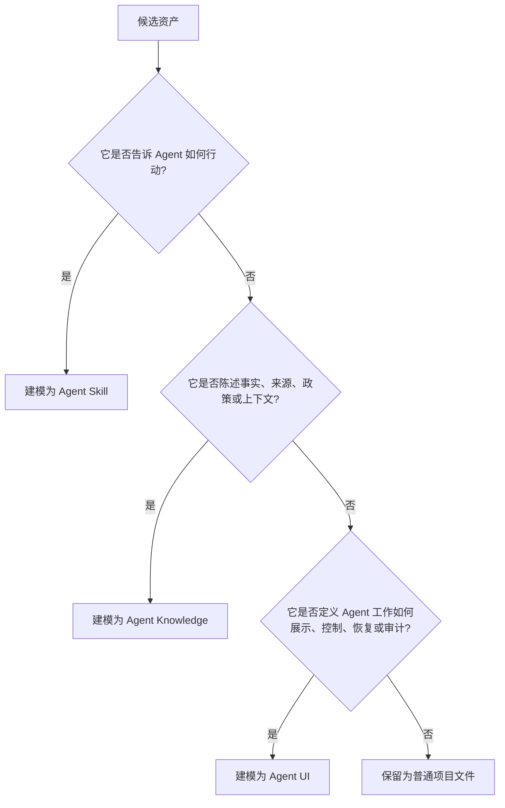

# Agent UI 与 Agent Skills / Agent Knowledge

Agent UI 不是可执行 Skill，也不是 Knowledge asset。它是面向用户侧 Agent 交互语义的第三个标准。

- **Agent Skills** 描述 Agent 如何执行工作：工作流、脚本、工具用法和模板。
- **Agent Knowledge** 描述有来源的资产：事实、文档、政策、状态和审计轨迹。
- **Agent UI** 描述 Agent 工作如何被呈现和控制：表面、状态、动作、可访问性和验收检查。

这个边界很重要，因为执行、事实和呈现有不同失败模式。

## 判断规则



简化规则：

- 如果内容在说 **运行这个流程或使用这个工具**，放进 Agent Skills。
- 如果内容在说 **这是真的、有来源、已评审、已过期或有争议**，放进 Agent Knowledge。
- 如果内容在说 **展示这个状态、提供这个控制、分离这个表面或测试这个交互**，放进 Agent UI。

## 边界表

| 边界 | Agent Skills | Agent Knowledge | Agent UI |
| --- | --- | --- | --- |
| 主要角色 | 可执行能力 | 有来源的知识 | 交互投影 |
| 核心契约 | Skill 激活与执行指南 | Knowledge 加载、溯源和信任边界 | Event-to-surface projection 与受控用户动作 |
| 核心内容 | 指令、脚本、工作流、工具用法。 | 事实、来源、维护文档、编译上下文。 | 表面模式、状态模型、控制、验收检查。 |
| 运行时动词 | 执行、转换、校验、维护、应用。 | 溯源、引用、约束、核验、解析。 | 渲染、披露、折叠、审批、中断、交接。 |
| 信任模型 | 信任和激活后可能驱动工具。 | 必须包裹为数据。 | 必须当作投影指南。 |
| 失败模式 | 不安全或错误动作。 | 编造、过期或被注入的事实。 | 误导状态、隐藏控制、污染最终回答。 |

## 如何组合

客户端可以在一个 Agent 任务里同时使用三者：

```text
user request
  -> select Skill for procedure
  -> select Knowledge for facts and boundaries
  -> run agent runtime
  -> project runtime facts through Agent UI surfaces
```

规则：

1. Skills 可以创建 UI 表面展示的 artifacts。
2. Knowledge 可以提供 Evidence 表面渲染的 citations。
3. Agent UI 可以定义 approval 和 artifact editing 出现在哪里。
4. Agent UI 不得执行 Skill，也不得把 Knowledge 重新解释成指令。
5. 缺失 runtime facts 时，Agent UI 不得编造成功、引用或 artifact 状态。

## 容易混淆的情况

| 资产 | 正确位置 | 原因 |
| --- | --- | --- |
| 审查 pull request 的工作流。 | Agent Skills | 它告诉 Agent 如何行动。 |
| 仓库已批准的发布政策。 | Agent Knowledge | 它是有来源的上下文。 |
| 展示 review findings、patch links 和 verification status 的模式。 | Agent UI | 它定义呈现和控制。 |
| 导出 evidence 的脚本。 | Agent Skills 或客户端工具 | 它执行工作。 |
| 导出的 evidence pack。 | Agent Knowledge 或 runtime evidence store | 它是数据和审计记录。 |
| 打开 evidence pack 的 UI card。 | Agent UI | 它是表面模式。 |

## 非目标

Agent UI 不标准化完整 Agent runtime、模型事件协议、CSS 系统、组件库、记忆层或 artifact 存储格式。它只标准化兼容客户端如何把 runtime facts 投影成交互语义。
