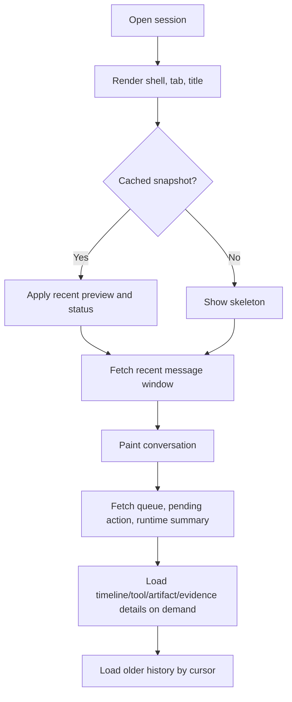

# 运行时标准

本指南描述 Agent 客户端如何实现 Agent UI。无论是桌面应用、IDE、终端、Web 应用还是嵌入式助手，核心集成都一样：消费结构化 runtime facts，投影成 UI state，再把用户控制通过受控 API 写回。完整 lifecycle 与分类词汇见[全流程与分类](../reference/flow-and-taxonomy)。

## 核心原则：投影，不拥有

```text
runtime facts
  + artifact facts
  + evidence facts
  + optional application state
  -> UI projection
  -> user-visible surfaces and controlled actions
```

兼容客户端 MUST NOT 让 UI projection 成为 runtime identity、tool output、artifact contents、permission state、verification results 或 approval state 的事实源。

## Step 1：识别事实源

从真实产品/runtime facts 开始，而不是从独立 manifest 文件开始。

| Source | 必需示例 | 说明 |
| --- | --- | --- |
| Event stream | lifecycle、text、reasoning、tool、action、queue、artifact、evidence events | submit work 前先注册 listener。 |
| Session snapshot | recent messages、thread/run status、queue、pending requests、history cursor | 用于旧 session 恢复和 stream repair。 |
| Artifact service | artifact id、kind、preview、read ref、version、diff、save/export/handoff status | Full content 按需加载。 |
| Evidence service | trace、source/citation、verification、review、replay、handoff | Evidence 应 durable 且可审计。 |
| Application state | selected workspace、active tab、file attachments、model/mode selections | 与 runtime facts 分离。 |

## Step 2：归一化事件类

创建 adapter layer，把源协议映射到通用 Agent UI event classes。

常见映射：

| Source idea | Agent UI class |
| --- | --- |
| Session/thread metadata events | `session.opened`、`session.updated`、`session.hydrated` |
| Lifecycle start/finish/error events | `run.started`、`run.finished`、`run.failed` |
| Runtime phase/status events | `run.status` |
| Text message events 或 AI SDK text parts | `text.delta`、`text.final` |
| Reasoning/thinking events 或 AI SDK reasoning parts | `reasoning.delta`、`reasoning.summary` |
| Plan/proposed-plan events | `plan.delta`、`plan.final` |
| Tool lifecycle events 和 structured tool results | `tool.started`、`tool.args`、`tool.progress`、`tool.output.delta`、`tool.result`、`tool.failed` |
| Interrupt outcomes、widget/tool requests 或 custom approval events | `action.required`、`action.resolved` |
| Runtime queue snapshot 或 busy-session submission mode | `queue.changed` |
| Background task、subagent 或 team updates | `task.changed`、`agent.changed` |
| Context、retrieval、memory 或 compaction facts | `context.changed`、`context.compaction.started`、`context.compaction.completed` |
| Permission、risk、sandbox 或 policy facts | `permission.changed` |
| Artifact created/updated/preview/version/diff/export events | `artifact.created`、`artifact.updated`、`artifact.preview.ready`、`artifact.version.created`、`artifact.diff.ready`、`artifact.export.started`、`artifact.export.completed`、`artifact.failed`、`artifact.deleted` |
| 折叠后的 artifact adapter events | `artifact.changed` |
| Evidence、review、replay、trace 或 source-map events | `evidence.changed` |
| Durable thread state、external app state 或 message repair | `state.snapshot`、`state.delta`、`messages.snapshot` |
| Safe diagnostics 或 metrics | `diagnostic.changed`、`metric.changed` |

Adapter 是兼容边界。不要把源协议解析散落到 UI 组件里。

## Step 3：维护 projection store

推荐 store 职责：

- 保存 recent message window 和 hydration cursor。
- 按稳定 id 保存 run status、pending actions、queue summaries 和 tool summaries。
- 用 id/ref 引用 artifacts 和 evidence，而不是复制完整 payload。
- 跟踪 selected tab、collapsed rows、focused artifact、draft 等 UI-only state。
- 只在安全 debug channel 保留 raw diagnostics。

Projection state 应能从 snapshots 和 events 重建。如果不能重建，它很可能拥有了不该拥有的 facts。

## Step 4：从 projection 渲染 surfaces

按 surface 职责渲染：

| Surface | 渲染规则 |
| --- | --- |
| Composer | 展示 draft、context chips、attachments、model/mode、permission hints 和 queue/steer mode。 |
| Message Parts | 最终回答文本与 reasoning、tools、actions、artifacts、evidence 分开渲染。 |
| Runtime Status | 首文本前展示 accepted/routing/preparing，之后展示 streaming/tool/blocked/retrying/failed/completed。 |
| Tool UI | 压缩 input/output，隐藏 secrets，大 payload offload，并链接详情。 |
| Human-in-the-loop | 用稳定 request ids 显示 approve/reject/edit/input 控件。 |
| Task Capsule | 摘要 running、queued、needs-input、plan-ready、failed、cancelled 和 subagent states。 |
| Artifact Workspace | 在专用表面打开交付物，并提供 cards、preview、edit/canvas、versions、diff/review、export、handoff 和 source/evidence links。 |
| Timeline / Evidence | 按需展示 process history、citations、verification、review、replay、handoff。 |
| Session / Tabs | 非活跃 sessions 使用 lightweight snapshots 和 lazy hydration。 |

## Step 5：连接受控写入

用户控制必须写入拥有该事实的服务。

| Control | API boundary |
| --- | --- |
| Send | Runtime submit API |
| Queue | Runtime queue API |
| Steer | Runtime steer/resume API |
| Interrupt/cancel | Runtime interrupt API |
| Approve/reject/respond | Runtime action response API |
| Edit/save/export artifact | Artifact service |
| Export/review/replay evidence | Evidence/review/replay service |
| Load older history | Session history API |

每次写入都应返回 fact 或 updated snapshot。UI state 不能自己宣布成功。

## Step 6：渐进恢复

旧 session 打开流程：



不要让 full timeline、所有 tool outputs、所有 artifacts 或 evidence export payloads 阻塞 shell 渲染。

## Step 7：埋点性能

至少记录：

- send click -> listener bound
- listener bound -> submit accepted
- submit accepted -> first event
- first event -> first runtime status
- first status -> first text delta
- first text delta -> first text paint
- delta backlog depth 和 oldest unrendered age
- old-session click -> shell paint
- old-session click -> recent messages paint
- detail success -> timeline idle complete
- active mounted message lists、timeline rows、hydrated tabs

这些指标是 UI 契约的一部分，因为它们决定长时间 Agent 工作时界面是否真的可用。
