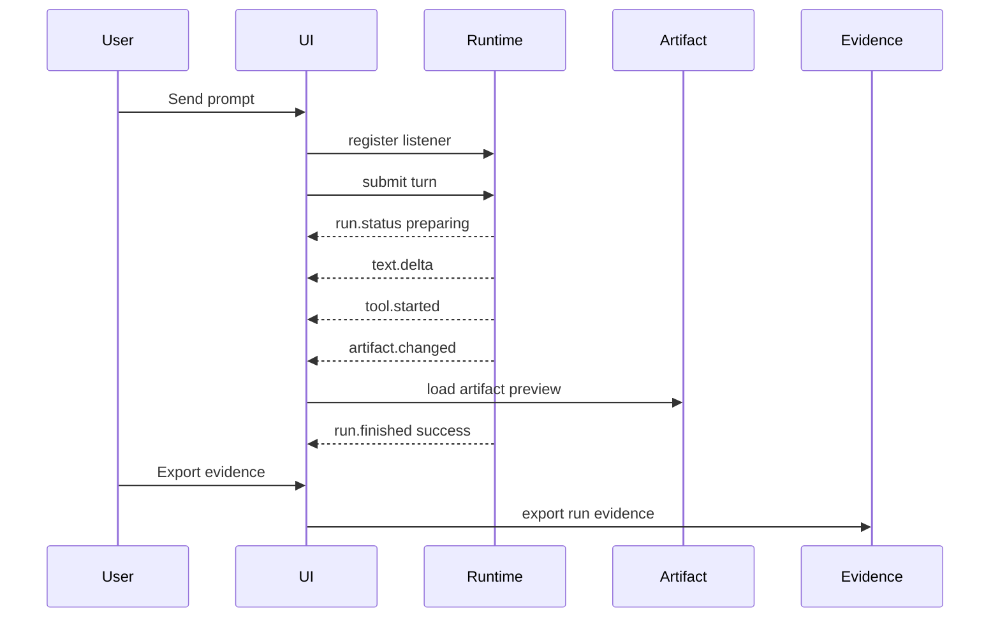

# 基础 Agent 工作台

这个示例展示一个消费 runtime events 和 durable snapshots 的最小 Agent 工作台。它不是可复用文件 bundle，可以直接存在于既有产品代码中。

## 布局

```text
BasicAgentWorkbench
  SessionTabs
  TaskCapsuleStrip
  ConversationPane
    MessageList
    RuntimeStatusStrip
    Composer
  WorkbenchPane
    ArtifactWorkspace
    EvidencePanel
  ProcessDrawer
    ToolTimeline
    Diagnostics
```

## Event adapter

```ts
function normalizeRuntimeEvent(event: RuntimeEvent): AgentUiEvent[] {
  switch (event.kind) {
    case 'turn_started':
      return [{ type: 'run.started', sessionId: event.sessionId, runId: event.turnId }]
    case 'runtime_status':
      return [{ type: 'run.status', runId: event.turnId, stage: event.stage, detail: event.detail }]
    case 'text_delta':
      return [{ type: 'text.delta', runId: event.turnId, messageId: event.messageId, delta: event.text }]
    case 'thinking_delta':
      return [{ type: 'reasoning.delta', runId: event.turnId, partId: event.partId, delta: event.text }]
    case 'tool_start':
      return [{ type: 'tool.started', runId: event.turnId, toolCallId: event.toolCallId, name: event.name, inputSummary: event.inputSummary }]
    case 'artifact_snapshot':
      return [{ type: 'artifact.changed', runId: event.turnId, artifactId: event.artifactId, kind: event.kind, preview: event.preview }]
    default:
      return []
  }
}
```

## Surface behavior

| Surface | Behavior |
| --- | --- |
| Session Tabs | 非活跃 sessions 显示 title、last activity、running/queued/pending count 和 stale marker。 |
| Task Capsule | Running 保持低调；`needs-input`、`plan-ready`、`failed` 抢注意力。 |
| Message Parts | User text 和 assistant final text 保持可读；reasoning 和 tools 是独立 parts。 |
| Runtime Status | `submitted`、`routing`、`preparing` 在首文本前出现。 |
| Tool Timeline | Tool rows 展示安全输入摘要、进度、结果和详情链接。 |
| Artifact Canvas | 最新关键 artifact 打开到 workbench surface。 |
| Evidence Panel | Evidence export 是后台动作，并提供 durable links。 |

## 发送流程



## 验收

工作台可接受的标准：

1. First runtime status 出现在 first text 之前。
2. Tool calls 可见，但不注入最终回答正文。
3. Reasoning 默认折叠或摘要。
4. 生成的 artifacts 打开在 message body 外部。
5. Queue 和 steer 视觉上不同。
6. Pending approval 有明确受控 response path。
7. 旧 sessions 先渲染 recent messages，再加载 timeline details。
8. Evidence export 链接回同一 run/session facts。

## Live demo

- [交互式工作台演示](./interactive-workbench.md)
