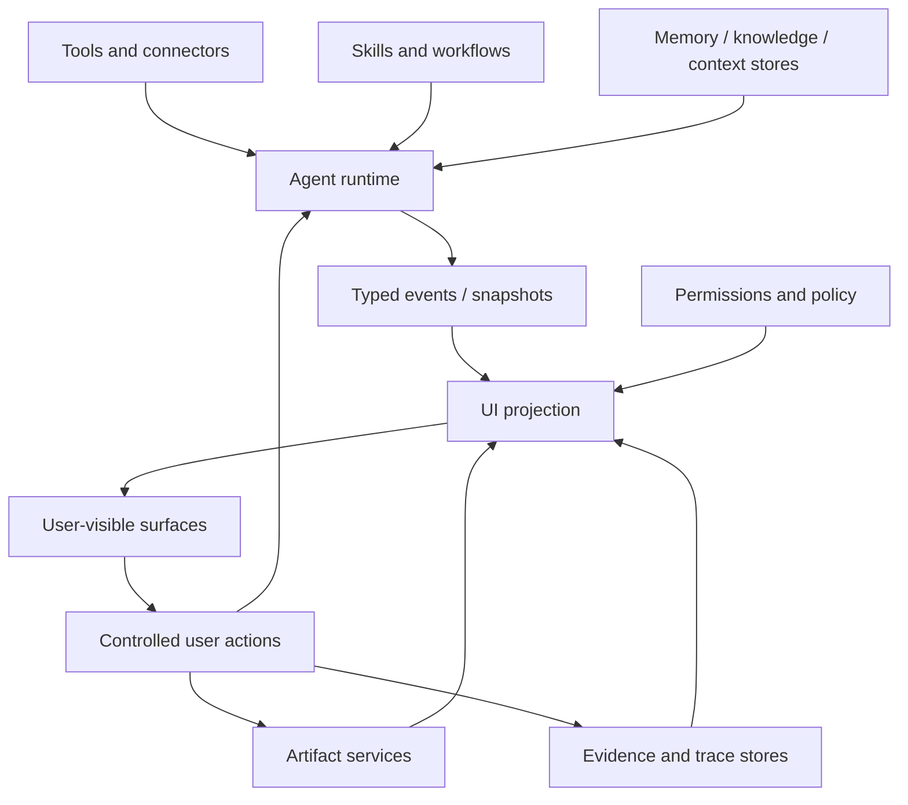

# Agent UI 生态边界

Agent UI 不应该被理解成只和某一两个相邻标准配套的第三块拼图。它服务的是完整 Agent 产品运行链路：runtime、模型输出、工具执行、skills 与 workflows、人工审批、产物、证据、会话、权限、上下文和宿主产品界面。

这个页面只回答一个问题：哪些内容属于 Agent UI，哪些内容只是 Agent UI 需要投影、引用或控制的外部事实。

## 核心判断

判断规则：

- 如果它定义 **用户如何看见、控制、恢复、编辑或审计 Agent 工作**，属于 Agent UI。
- 如果它定义 **Agent 如何执行某个流程、调用某个工具或维护某项工作**，属于 workflow / skill 系统。
- 如果它定义 **事实、来源、政策、记忆、引用或上下文边界**，属于 memory / knowledge / policy 系统。
- 如果它定义 **文件、画布、diff、导出物或可编辑结果的持久化**，属于 artifact 系统。
- 如果它定义 **trace、review、replay、verification 或 evidence pack**，属于 evidence / observability 系统。
- 如果它定义 **模型协议、工具协议、存储格式或组件视觉样式**，不是 Agent UI 的核心标准；Agent UI 只规定它们如何被投影到交互语义。

## 边界表

| 相邻系统 | 它拥有 | Agent UI 拥有 | 典型错误 |
| --- | --- | --- | --- |
| Agent runtime | run、turn、task、event、snapshot 的权威状态。 | 把 runtime facts 投影成状态、消息、任务和控制。 | UI 自己猜测 run 是否成功。 |
| Model / provider | 模型输入输出、stream delta、finish reason、usage。 | 把 text、reasoning、tool request、error 分型展示。 | 把 provider 原始日志直接塞进最终回答。 |
| Tools / connectors | 工具执行、输入输出、安全边界和结果数据。 | 工具进度、压缩摘要、详情入口、失败恢复。 | UI 把工具输出当成可执行指令。 |
| Skills / workflows | 可执行流程、脚本、模板、维护方法。 | 流程正在做什么、等待什么、用户能做什么。 | 把 UI 文档当成执行手册。 |
| Memory / knowledge / context stores | 事实、来源、引用、政策、上下文、过期状态。 | 引用展示、缺失状态、可信度提示和来源入口。 | UI 编造 citation 或把上下文重新解释成指令。 |
| Artifact services | 文件、对象、canvas、diff、版本、导出。 | artifact card、预览、编辑入口、交接状态。 | 把大文件内容塞进聊天正文。 |
| Evidence / observability | trace、review、replay、verification、audit record。 | timeline、evidence surface、导出进度和审计入口。 | 把 evidence 状态写成不可追溯的 UI 文案。 |
| Permission / policy | 权限、风险级别、审批结果、可执行范围。 | human-in-the-loop 请求、批准/拒绝/编辑控件。 | UI 在 runtime 确认前标记已批准。 |
| Session / storage | session identity、history、snapshot、索引。 | 渐进 hydration、tab 状态、恢复提示和加载窗口。 | 打开旧会话前强制加载所有历史和产物。 |
| Design system | 视觉组件、token、布局规则、响应式实现。 | 表面语义和验收行为。 | 把 Agent UI 降级成组件库或皮肤。 |

## Agent UI 真正标准化什么

Agent UI 标准化的是 **runtime facts 到用户交互语义的投影层**：

1. 哪些事件类别需要被客户端识别。
2. 哪些表面回答哪些用户问题。
3. 哪些用户动作必须通过受控 API 写回。
4. 缺失、失败、阻塞、等待输入和旧会话恢复如何诚实展示。
5. 如何避免把 reasoning、tool output、trace、artifact 和最终回答混成一列文本。

## 非目标

Agent UI 不拥有完整 Agent runtime、模型协议、工具注册、记忆系统、知识库、产物存储、证据存储、权限引擎、CSS 体系或组件实现。它只规定兼容客户端如何把这些系统产生的事实投影为清晰、可控、可恢复、可审计的交互表面。
