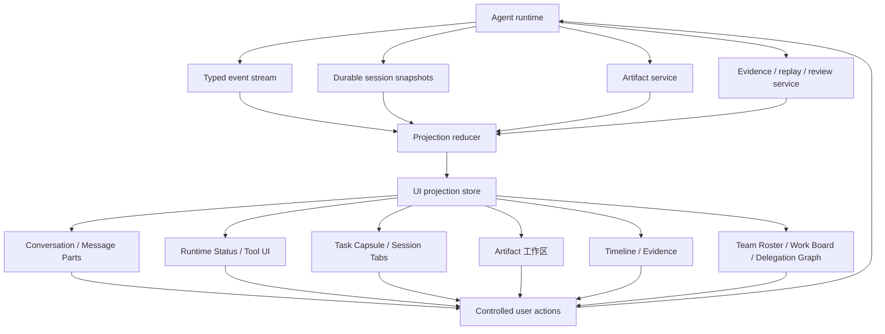

# 规范

Agent UI v0.6 是 runtime-first 的 Agent 交互表面标准。核心契约是 Agent facts 与用户可见 UI 之间的 projection 边界。

Agent UI 定义 runtime、tool、workflow、context、permission、artifact、evidence、session、task 和 team facts 如何变得可见、可控制、可恢复、可编辑和可审计，同时不让 UI 变成这些事实的权威来源。

完整 lifecycle、event envelope、owner/scope/phase/surface taxonomy 与 validation checklist 见[全流程与分类](../../reference/flow-and-taxonomy)。可追溯引用见[引用索引](../../reference/source-index)。

## 范围

Agent UI 标准化这些实现问题：

1. 客户端可投影的 event classes 和 durable snapshots。
2. Surface 职责和 fallback states。
3. 通过受控 API 写回的用户动作。
4. Hydration、progressive rendering、queue/steer 和性能预算。
5. 面向 coordinator/teammate、parallel workers、handoff、review、background teammates 与 remote teammates 的 Team Workbench 表面。
6. 面向真实 Agent 工作台的验收场景。

Agent UI **不**标准化模型协议、工具注册表、artifact store、CSS 系统、组件库或视觉皮肤。

## 投影架构

Projection store 可以保存 selected tab、collapsed sections、visible window、focused artifact、local draft 等 UI-only state。它不能成为 runtime identity、tool output、artifact content、permission state 或 evidence verdict 的权威来源。

## 必需事实所有者

兼容实现 SHOULD 分离这些 owner：

| Owner | 示例 | Writer | UI 使用 |
| --- | --- | --- | --- |
| Runtime facts | session id、turn id、lifecycle status、text deltas、tool calls、queue state、action requests | Agent runtime 或 protocol adapter | Conversation、Process、Task |
| Artifact facts | artifact id、kind、read ref、version、preview、diff、metadata、export state | Artifact service | Artifact 工作区 |
| Evidence facts | trace、citation、verification、replay id、review decision、audit record | Evidence 或 review service | Timeline / Evidence |
| Team facts | teammate id、role、parent/child session、work item、handoff、worker notification、remote task status | Agent runtime、team runtime、remote-agent adapter、work-board service | Team Roster、Work Board、Delegation Graph |
| UI projection | visible message window、collapsed tool count、selected tab、local draft、display label | UI controller | 仅渲染 |

Projection state 可以用 id 引用 facts，但不应复制大 payload，也不应从正文推断成功。

## 标准事件类

Agent UI 使用通用 event class 名称，方便客户端把 AI SDK UI、OpenAI Apps SDK、自定义桌面 runtime、事件流 runtime 或其他来源适配到同一投影模型。

| Event class | 目的 | 主表面 |
| --- | --- | --- |
| `run.started` | 建立 run、turn 或 task 边界。 | Runtime Status、Task |
| `run.status` | 展示 submitted、routing、preparing、streaming、retrying、cancelled、failed 或 completed。 | Runtime Status |
| `text.delta` / `text.final` | 流式展示并 reconcile 最终回答文本。 | Message Parts |
| `reasoning.delta` / `reasoning.summary` | 在最终回答之外展示 thinking 或 reasoning。 | Process |
| `tool.started` / `tool.args` / `tool.progress` / `tool.result` | 渲染工具生命周期、输入、输出和大输出引用。 | Tool UI、Timeline |
| `action.required` / `action.resolved` | 为审批、结构化输入、计划决策或修正暂停。 | Human-in-the-loop、Task |
| `queue.changed` | 展示排队 turn、steer intent、队列顺序和队列变更。 | Task Capsule、Composer |
| `agent.spawned` / `agent.completed` / `agent.changed` | 展示 teammate、subagent、worker 或 remote-agent lifecycle。 | Team Roster、Task Capsule |
| `team.changed` | 展示 roster、work-board、selected team、team memory 或 team policy 变化。 | Team Roster、Work Board |
| `agent.handoff` | 展示带 reason 与 resume target 的 active owner transfer。 | Handoff Lane、Delegation Graph |
| `worker.notification` | 展示 worker result/failure/kill summary，但不能当作用户消息。 | Worker Notifications、Timeline |
| `review.requested` / `review.completed` | 展示 reviewer/verifier work 与 verdict。 | Review Lane、Evidence |
| `artifact.created` / `artifact.updated` / `artifact.preview.ready` / `artifact.version.created` / `artifact.diff.ready` / `artifact.export.started` / `artifact.export.completed` / `artifact.failed` / `artifact.deleted` | 把生成、编辑、预览、版本化、diff、导出、失败或删除的交付物链接到 Artifact 工作区。 | Artifact 工作区 |
| `evidence.changed` | 链接 citations、traces、verification、replay 和 review。 | Timeline / Evidence |
| `state.snapshot` / `state.delta` | 同步外部应用或 Agent 状态。 | Session Tabs、Task、自定义表面 |
| `messages.snapshot` | 恢复或修复 conversation history。 | Message Parts、Session Tabs |
| `run.finished` / `run.failed` | reconcile completed、interrupt、cancelled 或 failed。 | Runtime Status、Task、Evidence |

## 标准表面

| Surface | 用户问题 | 不应拥有 |
| --- | --- | --- |
| Composer | 我将发送什么，带哪些上下文、模式、附件和 queue/steer 意图？ | Runtime queue facts 或 permission grants。 |
| Message Parts | 用户和助手说了什么，哪些是最终回答，哪些是过程？ | 把 tool output、reasoning 或 artifacts 当普通最终文本。 |
| Runtime Status | Agent 是否 accepted、routing、waiting、streaming、blocked、retrying、cancelled、failed 或 done？ | 超出 runtime facts 的 provider 真相。 |
| Tool UI | 哪个工具在运行，安全输入摘要是什么，输出预览和详情在哪里？ | 工具执行本身或带 secret 的原始 payload。 |
| Human-in-the-loop | 用户需要批准、拒绝、编辑或回答什么？ | 没有 runtime 确认的权限状态。 |
| Task Capsule | 跨 turn 和 subagent 有什么在运行、排队、阻塞、失败或需要注意？ | 完整 session history。 |
| Artifact 工作区 | 交付物在哪里，如何 preview、edit、diff、version、export、reuse 或 handoff？ | 没有 artifact service 所有权的 artifact content。 |
| Timeline / Evidence | 发生了什么，哪些事实支撑结果，如何 replay 或 review？ | 不是 evidence system 产生的 verification verdict。 |
| Session / Tabs | 哪些 session/thread active、hydrated、stale、unread、running 或 pinned？ | 非活跃 session 的完整 detail。 |
| Team Roster | Team 里有谁，每个 teammate 的 role/capability/policy/status 是什么，谁需要关注？ | Runtime teammate identity 或 permission truth。 |
| Work Board | 哪些 human/agent-owned work items 处于 open、claimed、blocked、reviewing 或 done？ | 没有 owning work-board/team API 的 task execution 或 board truth。 |
| Delegation Graph | Coordinator、workers、child sessions、wait edges 与 handoffs 如何产出结果？ | 不是 runtime/history 产生的 session lineage 或 evidence。 |
| Worker Notifications | 哪个 worker completed、failed 或 killed，result/usage/transcript ref 在哪里？ | 真实用户发言或 coordinator final answer text。 |
| Review Lane | Reviewer/verifier 做了什么决定，哪些 evidence 支撑？ | 不是 review/evidence systems 产生的 evidence verdict。 |
| Teammate Transcript | 某个 teammate 最近做了什么，哪些 input 正等待它？ | 无界完整 transcript history。 |
| Background / Remote Teammate | 哪些 background 或 remote teammates 处于 scheduled、working、input-required、auth-required、paused 或 done？ | Background scheduler 或 remote protocol truth。 |
| Team Policy | 每个 teammate 适用哪些 permission、sandbox、plan mode、budget 或 termination controls？ | 没有 runtime 确认的 permission grant。 |
| Diagnostics | 哪些安全诊断解释 latency、failure 或 protocol repair？ | 用户可见 success 或 evidence verdicts。 |

## Team Workbench 契约

Team Workbench 是 Agent UI 的核心表面组。它标准化 team-style multi-agent work 的投影方式，但不要求产品采用 hierarchy-first 隐喻。

兼容客户端 SHOULD 支持：

1. Human 与 agent teammates 的 roster，包含 `agentId`、`agentName`、`teamName`、role、source、status、model 与 policy。
2. 跨 `sessionId`、`threadId`、`taskId`、`parentSessionId`、`parentThreadId` 的 parent/child lineage。
3. Coordinator-worker fanout/fanin、wait controls、worker result notifications 与 merge/retry boundaries。
4. Specialist handoff，包含 `from`、`to`、reason、resume target、memory/context boundary 与 accepted state。
5. Review lane facts，包含 reviewer、target、verdict、evidence refs 与 requested fixes。
6. 有界 teammate transcript zoom，包含 recent messages、current tool activity 与 pending input queue。
7. Background teammates 作为 scheduled 或 triggered teammates，展示 wake reason、run record、pause/resume 与 sleep state。
8. Remote teammates 作为 remote agent cards/tasks，展示 input/auth-required states、messages 与 artifact updates。
9. 通过 `runtimeEntity` 映射 `agent_turn`、`subagent_turn`、`automation_job`、`external_task`、`work_item`，并在可用时保留 `teamPhase`、`teamParallelBudget`、`teamActiveCount`、`teamQueuedCount`、`queueReason` 等队列事实。

UI MUST NOT 把 worker notifications 当作用户发言、把 worker result 藏进 coordinator prose，或从 final answer 推断 team completion。Coordinator synthesis 与 worker results 是不同 facts。

## Artifact 工作区契约

Artifact 工作区是 Agent UI 的核心表面。它标准化 durable deliverables 的交互语义，但内容存储和 bytes 仍属于 artifact service。

兼容客户端 SHOULD 支持：

1. Conversation 或 process surfaces 里的紧凑 artifact cards。
2. 用于 preview、edit/canvas、diff/review、version history、export 和 handoff 的专用工作区。
3. 明确的 `artifact.kind`、`artifact.status`、`artifact.version.id`、`artifact.preview`、`artifact.read_ref`、`artifact.diff_ref`、`artifact.source_refs` 和 `artifact.evidence_refs`。
4. 可用时保留具体 artifact events，`artifact.changed` 只作为折叠后的 adapter event。
5. Message text 与 artifact body 分离。

UI MUST NOT 从 assistant prose 推断 saved state、export success、version identity 或 artifact kind。

## 受控写入动作

会改变状态的 UI action MUST 通过拥有该状态的系统写回：

| UI action | Required fact | Write boundary |
| --- | --- | --- |
| Send prompt | session/thread id、draft、context refs、mode | Runtime submit API |
| Queue input | active run 或 busy session、draft、queue policy | Runtime queue API |
| Steer current run | active run id、steering payload、policy | Runtime steer 或 resume API |
| Interrupt | run id、turn id、task id 或 session id | Runtime interrupt API |
| Delegate work | parent session/thread id、prompt、target role/team、policy | Runtime 或 team-control API |
| Continue teammate | teammate/agent id、input、target session/thread | Runtime 或 team-control API |
| Wait for teammate(s) | teammate ids 或 task ids、timeout policy | Runtime 或 team-control API |
| Stop or close teammate | teammate/agent id、reason、cascade policy | Runtime 或 team-control API |
| Assign work item | work item id、assignee、status、blocker | Work-board 或 team-control API |
| Request review | target artifact/task/evidence id、reviewer、policy | Runtime 或 review/evidence API |
| Approve/reject | action request id、decision、optional payload | Runtime action response API |
| Edit artifact | artifact id、version、patch/content | Artifact service |
| Export evidence | session/run/task id | Evidence export API |
| Open older history | session id、cursor/window | Session history API |

如果写入失败，UI 应保留现有 facts，把本次 action 标为 failed，并提供可恢复路径。

## Hydration 与渐进渲染

旧 session 和长任务不能被 full detail 阻塞。兼容实现 SHOULD 按这个顺序加载：

1. Shell、title、tab、轻量 runtime snapshot。
2. 最近 message window。
3. 当前 run status、pending action、queue summary 与 compact team summary。
4. Timeline summary 与紧凑 tool/artifact/evidence/team references。
5. Teammate transcripts、full tool output、artifact content、evidence payload、remote task detail 和 older history 只在按需时加载。

`historyLimit`、基于 cursor 的分页、idle timeline construction 和大输出 offload 属于 UI 契约的一部分，因为它们直接决定 Agent workspace 是否可用。

Active run 的渐进渲染 MUST 保留 typed event/part 顺序。Reasoning、tool progress、action-required、artifact refs 和 answer text 可以穿插出现；客户端不应把所有 reasoning 提到消息头部，或把所有 tool rows 推到尾部。Running process step 默认展开或显示 live body；run 完成后再折叠为 timeline summary。Inline process 与 timeline archive 是同一组 runtime facts 的两个投影模式，同一 fact 不应在同屏双重展开。

## Fallback states

事实缺失或延迟时，必须诚实展示状态：

- `loading`：请求已开始，但事实尚不可用。
- `unknown`：客户端无法从现有事实知道状态。
- `unavailable`：producer 不提供此事实。
- `stale`：snapshot 可能过期。
- `blocked`：runtime 缺少事实或动作而无法继续。
- `needs-input`：需要用户动作。
- `failed`：拥有系统报告失败。
- `disputed`：evidence/review 状态冲突。

兼容 UI MUST NOT 从普通正文推断 artifact kind、permission grant、success、verification pass 或 user approval。

## 校验

Validator SHOULD 校验行为和契约，而不只是检查文件：

- Event adapter 把 lifecycle、text、reasoning、tool、action、queue、artifact、evidence 和 session events 映射为 typed projection state。
- Event adapter 映射 team、agent、worker notification、handoff、background teammate、remote teammate 与 review facts，不能压平成 assistant prose。
- Final text reconciliation 防止 streamed/final output 重复。
- Reasoning、tool output、runtime status、artifacts 和 evidence 不污染最终回答正文。
- Active run 按 typed event/part 顺序穿插渲染 reasoning、tool progress 和 answer text。
- Running process 默认可见；completed process 默认折叠归档。
- Inline process 与 timeline archive 不同屏重复同一 runtime fact 的详情。
- Missing facts 渲染诚实 fallback states。
- User actions 通过受控 runtime/artifact/evidence APIs 写入。
- Team controls 通过受控 runtime/team/work-board/review APIs 写入。
- 旧 session 以 bounded history 和按需详情渐进恢复。
- Acceptance scenarios 覆盖 send、first status、tool call、action request、queue/steer、artifact handoff、evidence export、failure、old-session recovery、coordinator teams、parallel workers、specialist handoff、review teams、human/agent boards、background teammates 与 remote teammates。
